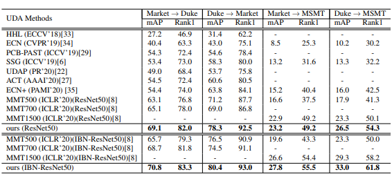
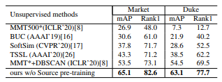

# Spatial-Channel Partition Network
Implement of paper:[Enhancing Diversity in Teacher-Student Networks via Asymmetric branches for Unsupervised Person Re-identification (WACV 2021)](https://arxiv.org/abs/2011.13776).

This implementation is based on [MMT (ICLR 2020)](https://github.com/yxgeee/MMT).

## Installation

```shell
git clone https://github.com/chenhao2345/ABMT
cd ABMT
python setup.py install
```

## Prepare Datasets

```shell
cd examples && mkdir data
```
Download the raw datasets [DukeMTMC-reID](https://arxiv.org/abs/1609.01775), [Market-1501](https://www.cv-foundation.org/openaccess/content_iccv_2015/papers/Zheng_Scalable_Person_Re-Identification_ICCV_2015_paper.pdf), [MSMT17](https://arxiv.org/abs/1711.08565),
and then unzip them under the directory like
```
ABMT/examples/data
├── dukemtmc-reid
│   └── DukeMTMC-reID
├── market1501
└── msmt17
    └── MSMT17_V1(or MSMT17_V2)
```

## Prepare Pre-trained Models
When *training with the backbone of [IBN-ResNet-50](https://arxiv.org/abs/1807.09441)*, you need to download the [ImageNet](http://www.image-net.org/) pre-trained model from this [link](https://drive.google.com/drive/folders/1thS2B8UOSBi_cJX6zRy6YYRwz_nVFI_S) and save it under the path of `logs/pretrained/`.
```shell
mkdir logs && cd logs
mkdir pretrained
```
The file tree should be
```
MMT/logs
└── pretrained
    └── resnet50_ibn_a.pth.tar
```

## Example #1:
Transferring from [DukeMTMC-reID](https://arxiv.org/abs/1609.01775) to [Market-1501](https://www.cv-foundation.org/openaccess/content_iccv_2015/papers/Zheng_Scalable_Person_Re-Identification_ICCV_2015_paper.pdf) on the backbone of [ResNet-50](https://arxiv.org/abs/1512.03385), *i.e. Duke-to-Market (ResNet-50)*.
#### Stage I: Pre-training on the source domain

```shell
sh ABMT_source_pretrain.sh dukemtmc market1501 resnet50_AB 
```

#### Stage II: End-to-end training with ABMT 

```shell
sh ABMT_target_adaptation.sh dukemtmc market1501 resnet50_AB
```

## Example #2:
Fully unsupervised learning on [Market-1501](https://www.cv-foundation.org/openaccess/content_iccv_2015/papers/Zheng_Scalable_Person_Re-Identification_ICCV_2015_paper.pdf) on the backbone of [ResNet-50](https://arxiv.org/abs/1512.03385).

#### End-to-end training with ABMT

```shell
sh ABMT_fully_unsupervised.sh market1501 resnet50_AB
```

## Results
#### Unsupervised Domain Adaptation Results


#### Fully Unsupervised Results


## Citation

```text
@InProceedings{Chen_2021_WACV,
author = {Chen, Hao and Lagadec, Benoit and Bremond, Francois},
title = {Enhancing Diversity in Teacher-Student Networks via Asymmetric branches for Unsupervised Person Re-identification},
booktitle = {The IEEE Winter Conference on Applications of Computer Vision (WACV)},
year = {2021}
}
```
